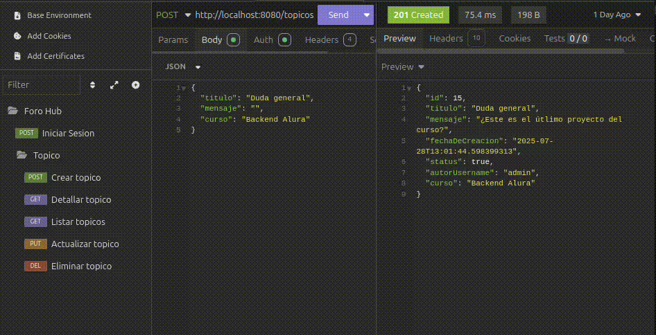

# Foro-Hub API


---

API REST desarrollada con Java y Spring Boot que permite la gestión de un foro: 
registro de tópicos, edición, consulta y eliminación. 
Forma parte del desafío del programa Oracle ONE en Alura Latam, y tiene como objetivo practicar la arquitectura de aplicaciones modernas con 
Spring Boot, JPA y autenticación segura con JWT.

---

## 🚀 Características

- Registro y autenticación de usuarios (encriptación con BCrypt + JWT).
- Endpoints CRUD completos para **tópicos**: crear, listar (con paginación), consultar por ID, actualizar y eliminar.
- Seguridad mediante Spring Security.

---

## 🛠 Tecnologías utilizadas

- Java 17  
- Spring Boot 3.5.3  
- Spring Data JPA
- Spring Security
- Lombok
- Flyway
- MySQL
- Maven
- Base de datos MySQL

---

- ## 🧱 Estructura del Proyecto

- `controller`: Maneja las solicitudes HTTP.
- `model`: Define las entidades de base de datos (Usuario, Tópico, Curso, etc).
- `repository`: Interfaces JPA para la persistencia.
- `service`: Lógica de negocio y reglas.
- `security`: Configuración de JWT y autenticación.
- `dto`: Clases para la transferencia de datos.

---

## ⚙️ Configuración Inicial

1. Clonar el repositorio:
   ```bash
   git clone https://github.com/JenniferButanda/Foro-Hub-desarrollo.git

2.Crea una base de datos local en MySQL (por ejemplo, llamada forohub).

3.Configura el archivo application.properties con tus credenciales:
  
  spring.datasource.url=jdbc:mysql://localhost:3306/forohub --> ejemplo
  spring.datasource.username=tu_usuario
  spring.datasource.password=tu_contraseña

4.Ejecuta el proyecto desde la clase principal:

  mvn spring-boot:run

---

## 🧪 Ejemplo de uso

- Crear un tópico

  POST /topicos
  Authorization: Bearer {token}
  Content-Type: application/json

```
  {
    "titulo": "Pregunta sobre JPA",
    "mensaje": "¿Cómo funciona la anotación @Entity?",
    "curso": "Spring Boot"
  }
```

- Listar tópicos

  GET /topicos
  Authorization: Bearer {token}

- Detallar topico
  
  GET /topicos/id_del_topico_a_consultar
  Authorization: Bearer {token}

- Actualizar topico

  PUT /topicos/id_del_topico_a_actualizar
  Authorization: Bearer {token}
  Content-Type: application/json

  ```
  {
	"titulo": "Pregunta sobre JPA",
	"mensaje": "Pregunta/mensaje actualizado",
	"curso": "Backend Alura"
  }
  ```
  
-Eliminar tópico

  DELETE /topicos/id_del_topico_a_eliminar
  Authorization: Bearer {token}




---

## 🧠 Aprendizajes

- Creación de APIs RESTful con buenas prácticas.

- Implementación de seguridad con JWT y autenticación basada en tokens.

- Organización de código usando capas (MVC + service + DTO).

- Migraciones automáticas de base de datos con Flyway.

- Uso de JPA y relaciones entre entidades.

---

## 📌 Notas

Se planea añadir:

  - Endpoint público para crear usuarios registrados.

  - Roles y permisos con Spring Security.

  - Pruebas automatizadas.

  - Despliegue en la nube.

  - Documentación automática con Swagger.

---

## Contacto

Si tienes dudas, comentarios o sugerencias, puedes escribirme a:  
📧 **butandajenny@gmail.com**

---

## Autores

- **Jennifer Butanda**  
  Estudiante del área Back-End  
  Bootcamp Oracle + Alura Latam

